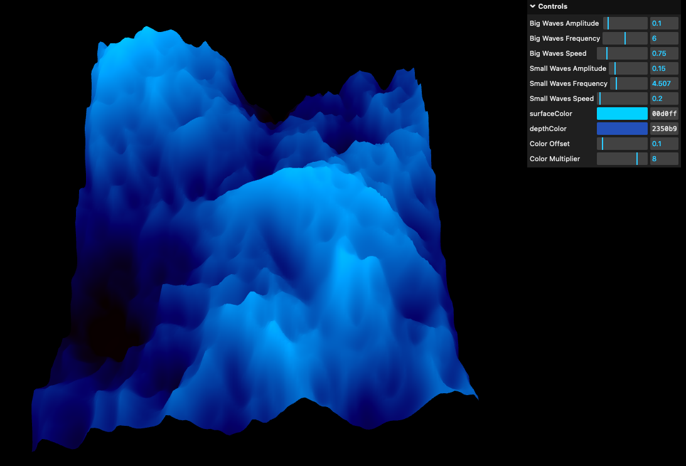
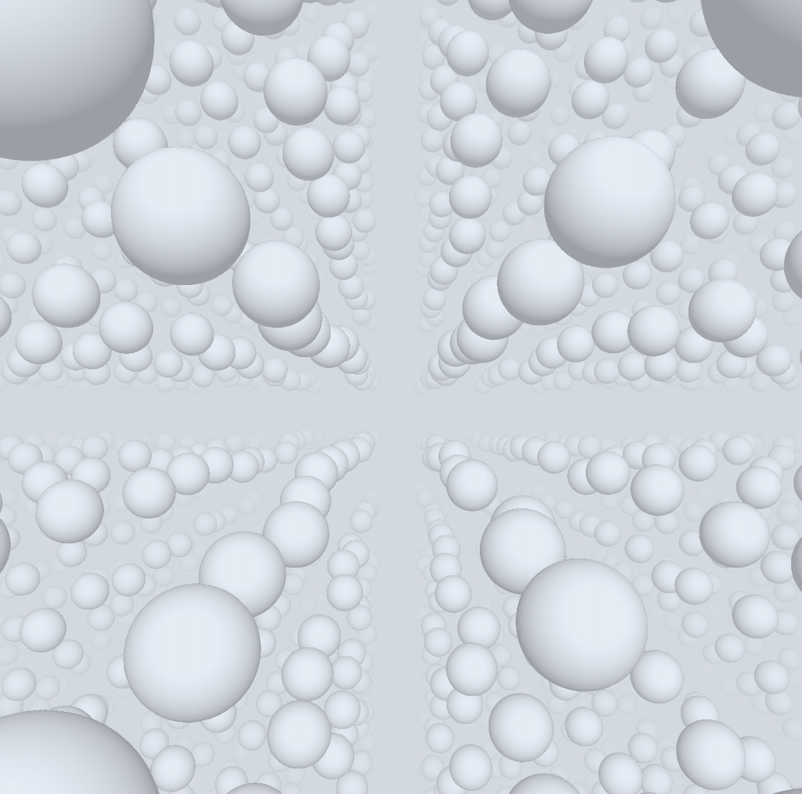
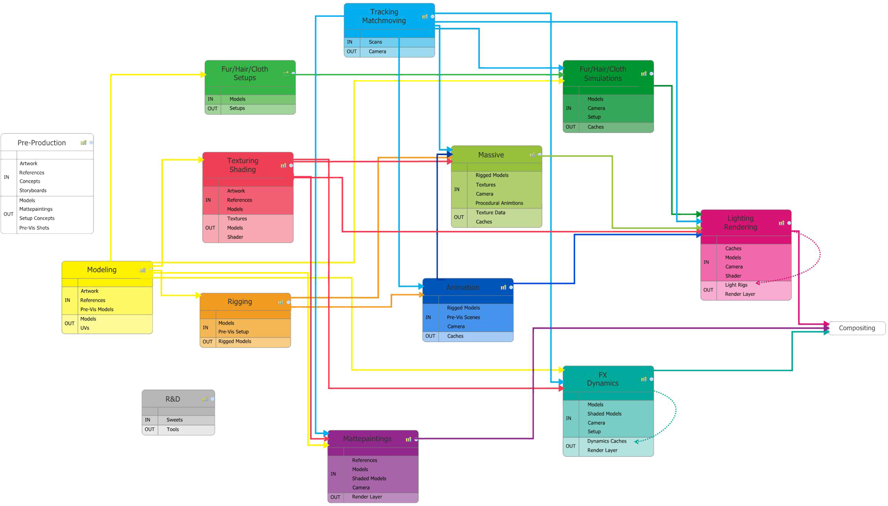
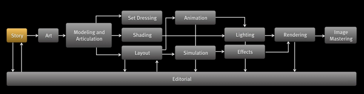
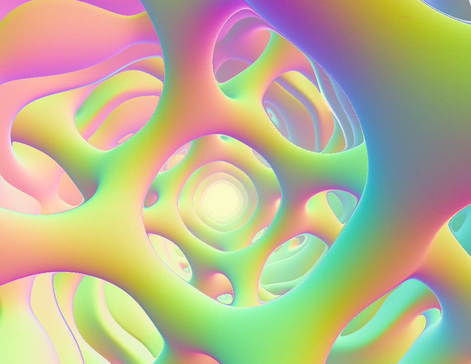
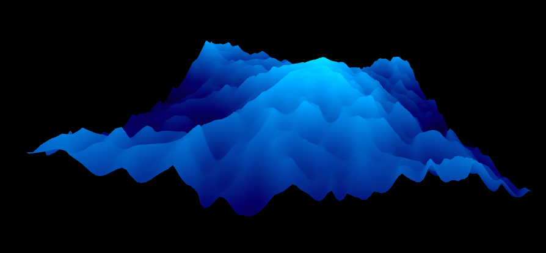

name: inverse
layout: true
class: center, middle, inverse
---

# Shader Programming Workshop

#### Prof. Dr. Lena Gieseke | l.gieseke@filmuniversitaet.de  
#### Film University Babelsberg KONRAD WOLF

 

## *Overview 1*

<!--
Start server in /doc/

h or ?: Toggle the help window
j: Jump to next slide
k: Jump to previous slide
b: Toggle blackout mode
m: Toggle mirrored mode.
c: Create a clone presentation on a new window
p: Toggle PresenterMode
f: Toggle Fullscreen
t: Reset presentation timer
<number> + <Return>: Jump to slide <number>
-->

---
layout: false

## The Workshop

> Shader programming is in itself just a technology.

--

It can be accessed

--
* with a given interface within a software and environment (e.g., Unreal, three.js)

--
* with custom code (e.g., C++ and OpenGL)

---
## The Workshop

--

Technology

--
* Shader pipeline

--
* Example three.js

--
* Fragment shader 

--
* Example Unreal

--

Scenario

* Rendering a 3D scene in in a fragment shader

---
## The Workshop

.center[]

---
## The Workshop

.center[]

---
layout: false

## 3D Engines

* A given environment such as a Unreal, Houdini, vvvv, TouchDesigner, p5, three.js etc.

--
* Assets such geometry, lights and materials already exists

--
* The engine does the rendering

???
  
This means we plug our shading development into a given environment such as p5, Unity, Houdini etc. and work with given assets such lights or material properties.

--

> 3D engines are a good option for complex scenes and realistic appearance.

---
.header[3D Engines]

## Anatomy of a 3D Rendering

.center[]

???

Pipeline as it was used at Scanline VFX. Pipeline can vary a lot, depending on the production house.

.task[TASK:] Explain the steps

---
.header[3D Engines]

## Anatomy of a 3D Rendering

.center[[Pixar, 2015]]

---
layout: false

## 3D Engines

We are are going to use three.js as engine first.

---
## The Fragment Shader Only

--

> Why?

--

* Good intro into GLSL and GPU programming
* Powerful in itself for many real-time artistic effects

???
  

* In the industry 

--

One graphics processing unit is very limited regarding processing power and memory!  

--

Their beauty comes through **massive parallelization**.

???
  

> So what?

--

* We need graphics algorithms that are suitable in this context

---
.header[The Fragment Shader Only]

## Rendering a 3D Scene

We are building the whole scene within the fragments shader itself, including the rendering. 

--

 
Possible visual content is still limited in comparison to working within a 3D software.

???

* https://www.shadertoy.com/view/WsSBzh
* https://www.youtube.com/watch?v=8--5LwHRhjk
* Comment on youtube: "I googled how to feel stupid and this video showed up."

--

> Fragment shaders are a good option for abstracted and simplified scenes based on procedural generation principles and whenever interactivity is crucial (e.g. in a performance scenario).

---
.header[The Fragment Shader Only | Rendering a 3D Scene]

## We Start With...

--

...nothing!

---

## Rendering a 3D Scene

--

> How?

--

We use *implicit geometry* descriptions and *sphere tracing* as rendering algorithm.

---
## The Workshop

.center[<video autoplay loop width="500"><source src="./img/preview_02.webm"type="video/webm"></video>]

---
## The Workshop

.center[]

---
## The Workshop

.center[<video autoplay loop width="500"><source src="./img/preview_04.webm"type="video/webm"></video>]

---
## The Workshop

.center[]

---
## The Workshop

.center[<video autoplay loop width="500"><source src="./img/preview_05.webm"type="video/webm"></video>]

---
## Possible Follow-up: Volumetric Rendering

.center[<video autoplay loop width="700"><source src="./img/preview_08.webm"type="video/webm"></video>]

---

## Workshop Topics

--
* Shader Pipeline & GLSL

--
* Vertex and Fragment shader in three.js

--
* Implicit Geometry

--
* Rendering Algorithms

--
* Sphere Tracing

--
* 3D Scene Setup

--
* Transformations

--
* Constructive Solid Geometry

--
* Further Effects

--
* Examples

--
* Unreal shader

--
* Creative Exploration

---

## Workshop Topics

This workshop will not cover shading and lighting in detail. For that, there is the upcoming *Materials & Shading* workshop.

.center[]

???
  

* Shader programming is still dominantly used for materials
* The workshop will build upon the shader programming workshop

--

There might be another follow-up workshop regarding volumetric rendering.

---

## Learning Objectives

With this workshop you gain

--
* a theoretical understanding of shader pipelines

--
* a theoretical understanding of rendering a 3D scene in a real-time context, 

--
* practical experiences with GLSL, shader programming, and implementing a ray marched 3D scene.

---

## Today

* Shader Pipeline & GLSL
* The vertex and fragment shader in three.js
* (Implicit Geometry in 2D)

  
<!--  
* Rendering Algorithms
* Sphere Tracing
* 3D Scene Setup  
-->

---

## Today

.center[]

---
template:inverse

# ✨ 
#### The End

