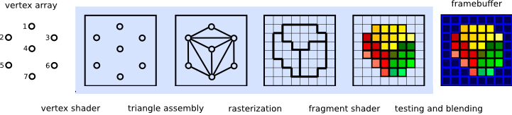
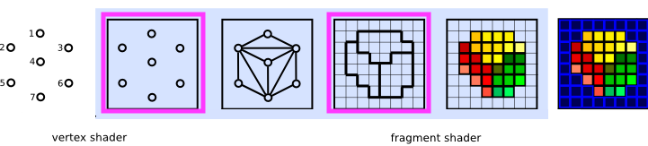
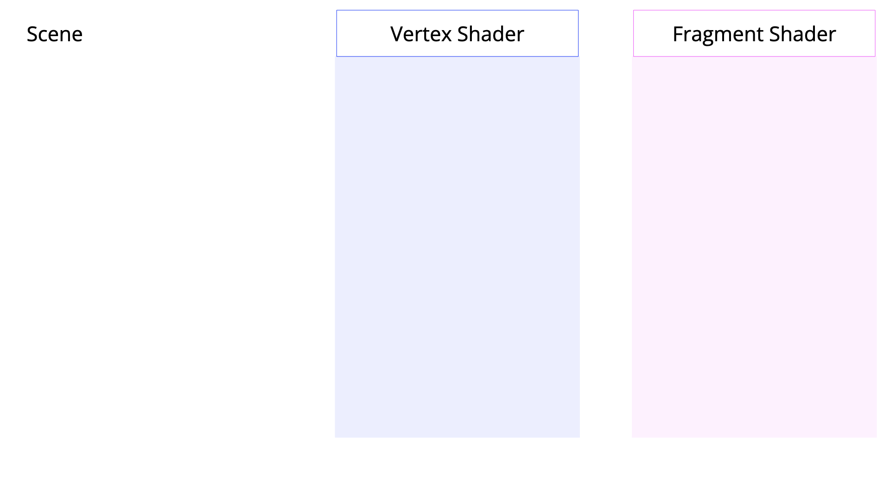

name: inverse
layout: true
class: center, middle, inverse
---

# Shader Programming Workshop

#### Prof. Dr. Lena Gieseke | l.gieseke@filmuniversitaet.de  
#### Film University Babelsberg KONRAD WOLF

<br >

## *Shader Pipeline & GLSL*


<!--
Start server in /doc/

h or ?: Toggle the help window
j: Jump to next slide
k: Jump to previous slide
b: Toggle blackout mode
m: Toggle mirrored mode.
c: Create a clone presentation on a new window
p: Toggle PresenterMode
f: Toggle Fullscreen
t: Reset presentation timer
<number> + <Return>: Jump to slide <number>
-->


---
template:inverse

# Shader Programming

???
  

* Shader Programming vs. Shading?

---
layout:false

.header[Shader Pipeline]

## GPU

A shader

--
* is a program that runs within the graphics pipeline on the GPU (Graphics Processing Unit)

--
* tells the computer how to render each pixel

.footnote[[[Tuts+]](https://gamedevelopment.tutsplus.com/tutorials/a-beginners-guide-to-coding-graphics-shaders--cms-23313)]

--

> These programs are called shaders because they are often used to control lighting and shading effects, but there's no reason they can't handle other special effects. 


---
.header[Shader Pipeline]

## GPU

--
* Many separate processors

--
* Rendering is split into separate hardware units and calculations

--
* Much faster than CPU-based software renderer with only 1-8 processors

.footnote[[[Anton Gerdelan]](http://antongerdelan.net/opengl/shaders.html)]


---
.header[Shader Pipeline]
## CPU vs. GPU

--

A CPU is to a GPU, as a writer is to a printing press.

.center[]

.footnote[[[Reilly Bova]](https://www.cs.princeton.edu/courses/archive/spring20/cos426/precepts/Precept-10.pdf)]

---
.header[Shader Pipeline]
## CPU vs. GPU

A CPU contains a few powerful general processors that can each perform complex tasks.  


???
  

* CPU cores

--
* Have a large memory bank (RAM)

--
* Can execute complex machine instructions

--
* Can support modest parallelization via multi-threading

--
* Threads can communicate with each other via RAM (this can cause trouble)


???
  

* https://developer.nvidia.com/blog/cuda-refresher-reviewing-the-origins-of-gpu-computing/
* https://www.intel.com/content/www/us/en/products/docs/processors/cpu-vs-gpu.html
* https://aws.amazon.com/compare/the-difference-between-gpus-cpus/
* https://www.heavy.ai/technical-glossary/cpu-vs-gpu

---
.header[Shader Pipeline]
## CPU vs. GPU

A GPU can contain thousands of microprocessors that can only perform simple tasks.


???
  

* GPU cores

--
*  Have a limited memory bank (VRAM)

--
* Can only execute simpler instructions

--
* Are blind: they cannot communicate with each other

--
* Forget: they cannot remember previous frames

--
* Designed for massive parallelization

.footnote[[[Reilly Bova]](https://www.cs.princeton.edu/courses/archive/spring20/cos426/precepts/Precept-10.pdf)]


???
  

* VRAM has to store the frame buffer, textures, and processing data for
each of the 1K+ cores (it’s crowded). Thus, cores have limited memory.

---
.header[Shader Pipeline | CPU vs. GPU]

.center[<iframe width="966" height="543" src="https://www.youtube.com/embed/8_ZTvG1WQxM" title="NVIDIA GPU vs CPU. &#39;Mythbusters&#39; stars paint the Mona Lisa in 80 Milliseconds!" frameborder="0" allow="accelerometer; autoplay; clipboard-write; encrypted-media; gyroscope; picture-in-picture; web-share" referrerpolicy="strict-origin-when-cross-origin" allowfullscreen></iframe>]


---
template:inverse

# Rendering

---
.header[Rendering]

## Rasterization vs. Ray Tracing

--

.center[ .imgref[[pixelsham](http://www.pixelsham.com/2019/10/24/whats-the-difference-between-ray-tracing-and-rasterization/)]]


???
  

* Rasterize: project polygons onto picture plane
* Raytrace: Cast light rays into scene through picture plane

---
.header[Rendering]

## Rasterization vs. Ray Tracing

.center[ .imgref[[zeduckmaster](https://zeduckmaster.frama.io/posts/2020-introduction-to-gpu/)]]


???
  

* Rasterize: project polygons onto picture plane
* Raytrace: Cast light rays into scene through picture plane

.center[ .imgref[[appuals](https://appuals.com/ray-tracing-vs-rasterized-rendering-explained/)]]


---
.header[Rendering]

## Rasterization Pipeline


.center[]

.footnote[[[Learn OpenGL](https://learnopengl.com/Getting-started/Coordinate-Systems)]]


???
  

* Local coordinates are the coordinates of your object relative to its local origin; they're the coordinates your object begins in.

https://learnopengl.com/Getting-started/Coordinate-Systems

---
.header[Rendering]

## Rasterization Pipeline


.center[]

.footnote[[[Learn OpenGL](https://learnopengl.com/Getting-started/Coordinate-Systems)]]

???
  

* The next step is to transform the local coordinates to world-space coordinates which are coordinates in respect of a larger world. These coordinates are relative to some global origin of the world, together with many other objects also placed relative to this world's origin.

https://learnopengl.com/Getting-started/Coordinate-Systems


---
.header[Rendering]

## Rasterization Pipeline


.center[]

.footnote[[[Learn OpenGL](https://learnopengl.com/Getting-started/Coordinate-Systems)]]


???
  

* Next we transform the world coordinates to view-space coordinates in such a way that each coordinate is as seen from the camera or viewer's point of view. 

https://learnopengl.com/Getting-started/Coordinate-Systems


---
.header[Rendering]

## Rasterization Pipeline


.center[]

.footnote[[[Learn OpenGL](https://learnopengl.com/Getting-started/Coordinate-Systems)]]

???
  

* After the coordinates are in view space we want to project them to clip coordinates. Clip coordinates are processed to the -1.0 and 1.0 range and determine which vertices will end up on the screen. Projection to clip-space coordinates can add perspective if using perspective projection. 

https://learnopengl.com/Getting-started/Coordinate-Systems


---
.header[Rendering]

## Rasterization Pipeline


.center[]

.footnote[[[Learn OpenGL](https://learnopengl.com/Getting-started/Coordinate-Systems)]]

???
  

* And lastly we transform the clip coordinates to screen coordinates in a process we call viewport transform that transforms the coordinates from -1.0 and 1.0 to the coordinate range defined by glViewport. The resulting coordinates are then sent to the rasterizer to turn them into fragments. 

https://learnopengl.com/Getting-started/Coordinate-Systems


---
.header[Rendering]

## Rasterization Pipeline


.center[]

.footnote[[Martin Fuchs. Image Synthesis Lecture. University of Stuttgart]]


???
  

* https://www.cs.cornell.edu/courses/cs4620/2020fa/demos_cs4620/view_explore/view_explore.html
* https://www.cs.cornell.edu/courses/cs4620/2020fa/slides/11pipeline.pdf
* https://vitaminac.github.io/Matrices-in-Computer-Graphics/#View-Matrix


---
.header[Rendering]


## Rasterization Pipeline

  
.center[]
 

.footnote[[[Evas GL Programming Guide]](https://www.enlightenment.org/playground/evas-gl.md)]

--

* A 3D environment fills memory buffers with arrays of vertices


???
  

* e.g. OpenGL-managed  


---
.header[Rendering]

## Rasterization Pipeline
 
.center[]
 

.footnote[[[Evas GL Programming Guide]](https://www.enlightenment.org/playground/evas-gl.md)]

* Vertices are 
    * projected into screen space


???
Shader programs run on the GPU, and are highly parallelised. Each vertex shader only transforms 1 vertex. If we have a mesh of 2000 vertices, then 2000 vertex shaders will be launched when we draw it. Because we can compute each one separately, we can also run them all in parallel. Depending on the number of processors on the GPU, you might be able to compute all of your mesh's vertex shaders simultaneously. 

---
.header[Rendering]


## Rasterization Pipeline
 
.center[]
 

.footnote[[[Evas GL Programming Guide]](https://www.enlightenment.org/playground/evas-gl.md)]

* Vertices are 
    * projected into screen space
    * assembled into triangles

---
.header[Rendering]


## Rasterization Pipeline
 
.center[]
 

.footnote[[[Evas GL Programming Guide]](https://www.enlightenment.org/playground/evas-gl.md)]

* Vertices are 
    * projected into screen space
    * assembled into triangles
    * rasterized into pixel-sized fragments

---
.header[Rendering]

## Rasterization Pipeline
 
.center[]
 

.footnote[[[Evas GL Programming Guide]](https://www.enlightenment.org/playground/evas-gl.md)]

* Fragments are 
    * assigned color values

.footnote[[[Evas GL Programming Guide]](https://www.enlightenment.org/playground/evas-gl.md)]

---
.header[Rendering]

## Rasterization Pipeline
 
.center[]
 
.footnote[[[Evas GL Programming Guide]](https://www.enlightenment.org/playground/evas-gl.md)]

* Fragments are 
    * assigned color values 
    * drawn to the framebuffer

.footnote[[[Evas GL Programming Guide]](https://www.enlightenment.org/playground/evas-gl.md)]


???
Difference Between Fragments and Pixels

A pixel is a "picture element". In OpenGL lingo, pixels are the elements that make up the final 2D image that it draws inside a window on your display. A fragment is a pixel-sized area of a surface. A fragment shader determines the colour of each one. Sometimes surfaces overlap - we then have more than 1 fragment for 1 pixel. All of the fragments are drawn, even the hidden ones.

Each fragment is written into the framebuffer image that will be displayed as the final pixels. If depth testing is enabled it will paint the front-most fragments on top of the further-away fragments. In this case, when a farther-away fragment is drawn after a closer fragment, then the GPU is clever enough to skip drawing it, but it's actually quite tricky to organise the scene to take advantage of this, so we'll often end up executing many redundant fragment shader invocations. 

https://antongerdelan.net/opengl/shaders.html

---
.header[Rendering]

## Rasterization Pipeline
 
.center[]


> The mapping of scene geometry to pixels.

 
.footnote[[[Evas GL Programming Guide]](https://www.enlightenment.org/playground/evas-gl.md)]


---
.header[Rendering]

## GPU

.center[]

* 36 vertices for a cube of triangles
* 36 vertex shaders execute in parallel

.footnote[[[Anton Gerdelan]](http://antongerdelan.net/opengl/shaders.html)]


???
* Vertex shader

Common drawing operations such as transforming each vertex and colouring each fragment can be done independently. We write a shader (mini program) to compute these operations, and the GPU's highly parallel architecture will attempt to compute them all concurrently.

---
.header[Rendering]

## GPU

.center[]

* 2d triangle covers n pixels (after rasterization)
* n fragment shaders execute in parallel

.footnote[[[Anton Gerdelan]](http://antongerdelan.net/opengl/shaders.html)]


???
  
* Fragment shader
* 7 fragments for this triangle

---
.header[Rendering]

## GPU

.left-even[  
]
.right-even[<br ><br >]

.footnote[[[Anton Gerdelan]](http://antongerdelan.net/opengl/shaders.html)]

---
.header[Rendering]

## GPU

| Release Date | GPU | Shading Units |
| ------------ | --- | ------------- |
| 2017 | Nvidia GeForce GTX 1080 Ti | 3584 |
| 2022 | AMD Radeon RX 7900 XTX | 6144 |
| 2022 | Nvidia GeForce RTX 4090 | 16384 |


.footnote[[[Anton Gerdelan]](http://antongerdelan.net/opengl/shaders.html)]


???

* Comparison of Selected OpenGL4-Capable GPUs
* Because there is a lot of variation in user GPU hardware, we can only make very general assumptions about the ideal number of vertices or facets each mesh should have for best performance. Because we only draw one mesh at a time, keeping the number of separate meshes drawn per-scene to a low-ish level is often beneficial (reducing the batch count per rendered frame) - the idea is to keep as many of the processors in use at once as possible. 
* 


---
template:inverse

# Shader Programming

---

## Shader Programming


.center[]

.footnote[[Image Synthesis 2016, M. Fuchs, University of Stuttgart]]


---
.header[Shader Programming]

## Geometry Processing

.center[]
 
.footnote[[Image Synthesis 2016, M. Fuchs, University of Stuttgart]]


???
  
* The **vertex shader** is responsible for the transformations applied on the vertices; mainly, the coordinate transforms required for the position, but it can also perform other calculations (e.g. Gouraud shading).
* The **geometry shader** is able to remove and insert primitives into the primitive stream, right before actual rasterization begins.
* **Tesselation shaders** are newer than geometry shaders, but come earlier in the pipeline. They were introduced, because
    * geometry shaders were not general enough (what if we need more data for subdivision than the _ADJACENCY primitives can carry?)
    * subdivision is a very common problem, but complicated to implement, and it would make sense to centralize some support.
* As a solution, OpenGL includes tesselation shaders, and splits the tesselation problem into three subcomponents:
    * The tesselation control shader decides into how many primitives the incoming GL_PATCH should be subdivided (and additional details)
    * The hard-coded tesselation primitive generator performs the actual subdivision
    * The tesselation evaluation shader gets to move the patch vertices resulting from the subdivision.


* https://www.khronos.org/opengl/wiki/Vertex_Shader
* https://www.khronos.org/opengl/wiki/Tessellation
* https://www.khronos.org/opengl/wiki/Tessellation_Control_Shader
* https://www.khronos.org/opengl/wiki/Tessellation_Evaluation_Shader
* https://www.khronos.org/opengl/wiki/Geometry_Shader


---
.header[Shader Programming]

## Rasterization

.center[]
 
.footnote[[Image Synthesis 2016, M. Fuchs, University of Stuttgart]]


---
.header[Shader Programming]

## Fragment Processing

.center[]

.footnote[[Image Synthesis 2016, M. Fuchs, University of Stuttgart]]


???
  

* https://www.khronos.org/opengl/wiki/Fragment_Shader
* https://www.khronos.org/opengl/wiki/Compute_Shader

https://learnopengl.com/Getting-started/Hello-Triangle


---
.header[Shader Programming]

## Data Elements


| Stage                          | Data Element               |
| ------------------------------ | -------------------------- |
| Vertex Shader                  | per vertex                 |
| Tessellation Control Shader    | per vertex (in a patch)    |
| Tessellation Evaluation Shader | per vertex (in a patch)    |
| Geometry Shader                | per primitive              |
| Fragment Shader                | per fragment               |
| Compute Shader                 | per (abstract) "work item" |

.footnote[[Joey de Vries. 2020. [Learn OpenGL: Learn modern OpenGL graphics programming in a step-by-step fashion](https://learnopengl.com/Guest-Articles/2022/Compute-Shaders/Introduction). Kendall & Welling]]


---
.header[Shader Programming]

## Data Elements


.center[]

.footnote[[Image Synthesis 2016, M. Fuchs, University of Stuttgart]]


???
| Stage                          | Data Element               |
| ------------------------------ | -------------------------- |
| Vertex Shader                  | per vertex                 |
| Tessellation Control Shader    | per vertex (in a patch)    |
| Tessellation Evaluation Shader | per vertex (in a patch)    |
| Geometry Shader                | per primitive              |
| Fragment Shader                | per fragment               |
| Compute Shader                 | per (abstract) "work item" |


---
.header[Shader Programming]

## Compute Shader (> GL 4.3)

--

* Not part of the regular rendering pipeline
    * For computing arbitrary information
--
* Single-stage, stateless

--
* No user-defined inputs and no outputs

--
* *The compute shader itself defines the data "space" it operates on as work groups*
    * You define the number of executions and their initializations

.footnote[[OpenGL Wiki. 2024. [Compute Shader](https://www.khronos.org/opengl/wiki/Compute_Shader), OpenGL Extensions. 2024. [ARB_compute_shader](https://registry.khronos.org/OpenGL/extensions/ARB/ARB_compute_shader.txt); Joey de Vries. 2020. [Learn OpenGL: Learn modern OpenGL graphics programming in a step-by-step fashion](https://learnopengl.com/Guest-Articles/2022/Compute-Shaders/Introduction). Kendall & Welling]]


???
  

Overview
* Recent graphics hardware has become extremely powerful and a strong desire to harness this power for work (both graphics and non-graphics) that does not fit the traditional graphics pipeline well has emerged. To address this, this extension adds a new single-stage program type known as a compute program. This program may contain one or more compute shaders which may be launched in a manner that is essentially stateless. This allows arbitrary workloads to be sent to the graphics hardware with minimal disturbance to the GL state machine.
* In most respects, a compute program is identical to a traditional OpenGL program object, with similar status, uniforms, and other such properties. It has access to many of the same resources as fragment and other shader types, such as textures, image variables, atomic counters, and so on. However, it has no predefined inputs nor any fixed-function outputs. It cannot be part of a pipeline and its visible side effects are through its actions on images and atomic counters.
* OpenCL is another solution for using graphics processors as generalized compute devices. This extension addresses a different need. For example, OpenCL is designed to be usable on a wide range of devices ranging from CPUs, GPUs, and DSPs through to FPGAs. While one could implement GL on these types of devices, the target here is clearly GPUs. Another difference is that OpenCL is more full featured and includes features such as multiple devices, asynchronous queues and strict IEEE semantics for floating point operations. This extension follows the semantics of OpenGL - implicitly synchronous, in-order operation with single-device, single queue logical architecture and somewhat more relaxed numerical precision requirements. Although not as feature rich, this extension offers several advantages for applications that can tolerate the omission of these features. Compute shaders are written in GLSL, for example and so code may be shared between compute and other shader types. Objects are created and owned by the same context as the rest of the GL, and therefore no interoperability API is required and objects may be freely used by both compute and graphics simultaneously without acquire-release semantics or object type translation.

Documentation
* Compute shaders cannot have any user-defined input variables. If you wish to provide input to a CS, you must use the implementation-defined inputs coupled with resources like storage buffers or Textures. You can use the shader's invocation and work group indices to decide which data to fetch and process. 
* Compute shaders do not have output variables. If you wish to have a CS generate some output, you must use a resource to do so. Shader storage buffers and Image Load Store operations are useful ways to output data from a CS.

They have the advantage of running on the GPU in a parallel fashion and be very fast and, therefore, are extremely handy for accelerating rendering techniques or for running GPUGPU (General Purpose GPU) algorithms. That means that they can be used to do all the expensive grunt work on the GPU and work with the CPU to present the results or used in any way you can think of.

* https://learnopengl.com/Guest-Articles/2022/Compute-Shaders/Introduction
* https://anteru.net/blog/2018/intro-to-compute-shaders/

---
.header[Shader Programming]

.center[ .imgref[[[khronos]](https://registry.khronos.org/OpenGL/specs/gl/glspec43.core.pdf)]]


---
.header[Shader Programming]

## GPGPU Computing

--

* General Purpose GPU
    * Purposes beyond graphics processing
    * All modern GPUs are GPGPUs
--

* Fundamentally a software concept


--
  
CUDA

* Developed by NVIDIA
* General-purpose parallel computing
* Targets NVIDIA GPUs


.footnote[[Heavy.Ai. 2024. [GPGPU](https://www.heavy.ai/technical-glossary/gpgpu)]]


???
  

* If a graphics card is compatible with any particular framework that provides access to general purpose computation, it is a GPGPU. 


---
template:inverse

# GPU Programming Language(s)

---

## GPU Programming Language

### OpenGL

--
OpenGL =  **Open** **G**raphics **L**ibrary 

--
* Cross-language, cross-platform application programming interface (API) for rendering graphics  

--
* API for interacting with a graphics processing unit (GPU)

???
  

* 2D and 3D vector 
* to achieve hardware-accelerated rendering.

--
  
Since 2006, OpenGL has been managed by the non-profit technology consortium Khronos Group.


???
  

* https://registry.khronos.org/OpenGL/specs/gl/glspec43.core.pdf
* 
* https://blog.minhazav.dev/hellow-world-in-open-gl/#rendering-a-triangle

To the programmer, OpenGL is a set of commands that allow the specification of
shader programs or shaders, data used by shaders, and state controlling aspects of
OpenGL outside the scope of shaders. Typically the data represent geometry in two
or three dimensions and texture images, while the shaders control the geometric
processing, rasterization of geometry and the lighting and shading of fragments
generated by rasterization, resulting in rendering geometry into the framebuffer.

---

## GPU Programming Language

### GLSL

GLSL = Open **G**raphics **L**ibrary **S**hader **L**anguage  

--
> GLSL is used to write shader programs, which are used by OpenGL applications to render graphics.

--
  
* It executes on the GPU
* Part of the OpenGL specification
* C/C++ flavoured


???
  

* OpenGL Shading Language (GLSL) is a high-level shading language with a syntax based on the C programming language. It was created by the OpenGL ARB (OpenGL Architecture Review Board) to give developers more direct control of the graphics pipeline without having to use ARB assembly language or hardware-specific languages. 


---
.header[Shader Pipeline | GPU Programming Language]

## GLSL

.center[]


---
.header[Shader Pipeline | GPU Programming Language]

## GLSL

What’s missing from C in GLSL syntax:


--
* No implicit casting => You must explicitly cast everything

--
* No libraries => You must write/provide all the code yourself

--
* No dynamic memory => All memory is static

--
* No recursion => You must unroll recursive functions into loops

--
* No pointers => Yay?

--
* No objects (but there is `struct`)

--
* No char, no string

--
* No I/O => No trace statements!

---
.header[Shader Pipeline | GPU Programming Language]

## GLSL Documentation

* https://registry.khronos.org/OpenGL/specs/gl/
* https://registry.khronos.org/OpenGL/specs/gl/GLSLangSpec.4.60.html
* https://www.khronos.org/files/opengl45-quick-reference-card.pdf (starting page 9)


---
.header[Shader Pipeline | GPU Programming Language]

## Versions Matter!

OpenGL and GLSL are constantly evolving. It is should to be clear about the version you are using.  


> Check if your environment expects a specific version.

---
.header[Shader Pipeline | GPU Programming Language]

## OpenGL & GLSL Versions

**Current version: 4.6**

E.g., not downward compatible additions:

* 3.2 geometry shaders
* 4.0 tessellation control and evaluation shaders
* 4.3 compute shader


???
  

* https://en.wikipedia.org/wiki/OpenGL_Shading_Language


---
.header[Shader Pipeline | GPU Programming Language]

## Versions Matter!

In professional programs the first line in a GLSL shader indicates a version tag, e.g.

```glsl
#version 400
```

.footnote[[[Wikipedia]](https://en.wikipedia.org/wiki/OpenGL_Shading_Language)]


---
.header[Shader Pipeline | GPU Programming Language]

## The Khronos Group

.center[]


---
.header[Shader Pipeline | GPU Programming Language]

## WebGL

--

WebGL = **Web** **G**raphics **L**ibrary

* JavaScript API for rendering interactive 2D and 3D graphics
* Compatible with any web browser without the use of plug-ins

--
* Based on OpenGL ES

--

OpenGL ES = OpenGL for Embedded Systems

* Subset of the OpenGL


???
  


```js
function createProgram(gl, vertexShader, fragmentShader)
{
    // create a program.
    let program = gl.createProgram();
    
    // attach the shaders.
    gl.attachShader(program, vertexShader);
    gl.attachShader(program, fragmentShader);
    
    // link the program.
    gl.linkProgram(program);
    
    // Check if it linked.
    let success = gl.getProgramParameter(program, gl.LINK_STATUS);
    if (!success)
    {
        // something went wrong with the link
        throw ("program failed to link:" + gl.getProgramInfoLog (program));
    }
    return program;
};
```

```html
<script src="resources/webgl-utils.js"></script>
let program = webglUtils.createProgramFromScripts(gl, vertexScript, fragmentScript);
```


---
.header[Shader Pipeline | GPU Programming Language]

## Vulkan

--

> The next generation OpenGL initiative.

.footnote[[[Wiki: Vulkan]](https://www.wikiwand.com/en/Vulkan_(API))]

--
* Lower overhead
* More direct control over the GPU
* Lower CPU usage

---
.header[Shader Pipeline | GPU Programming Language]

## Vulkan

> Vulkan targets high-performance real-time 3D-graphics applications and experienced graphics programmers.

---
.header[Shader Pipeline | GPU Programming Language | Vulkan]

.center[]

.footnote[[[Vulkan Tutorial]](https://vulkan-tutorial.com/Compute_Shader#page_Compute-pipelines)]


???
  

* In this diagram we can see the traditional graphics part of the pipeline on the left, and several stages on the right that are not part of this graphics pipeline, including the compute shader (stage)


---
.header[Shader Pipeline]

## Khronos Group Alternatives

--
Direct3D

* Developed by Microsoft, part of the DirectX suite of APIs
* Deep integration with Windows and Xbox platform
* HLSL

--

Metal

* Developed by Apple
* Optimized for Apple's hardware and software ecosystem
* Tight integration with Apple's development tools (Xcode)


.footnote[[ChatGPT 4o]]

---
template:inverse

# Vertex & Fragment Shader

---
## Shader Pipeline

Many graphic environments give you access to 

* Vertex shader
* Fragment shader

--

This means we have control over vertices and fragments:

.center[]


 
.footnote[[[Evas GL Programming Guide]](https://www.enlightenment.org/playground/evas-gl.md)]


???
* Position vertices
* Color fragments


---
.header[Shader Pipeline | GLSL]

## Vertex Shader

--
* Called once per vertex in the scene

--
* Generates clip space coordinates 

.center[.imgref[[[songho]](https://songho.ca/opengl/gl_projectionmatrix.html)]]  


???
  

* Perspective Frustum and Normalized Device Coordinates (NDC)
*  In perspective projection, a 3D point in a truncated pyramid frustum (eye coordinates) is mapped to a cube (NDC); the range of x-coordinate from [l, r] to [-1, 1], the y-coordinate from [b, t] to [-1, 1] and the z-coordinate from [-n, -f] to [-1, 1].
* Note that the eye coordinates are defined in the right-handed coordinate system, but NDC uses the left-handed coordinate system. That is, the camera at the origin is looking along -Z axis in eye space, but it is looking along +Z axis in NDC. Since glFrustum() accepts only positive values of near and far distances, we need to negate them during the construction of GL_PROJECTION matrix. 

---
.header[Shader Pipeline | GLSL]

## Vertex Shader

* Called once per vertex
* Generates clip space coordinates

It always takes the form

```glsl
void main() {   

    // ...
    gl_Position = makeClipspaceCoordinates;
}
```


???
  

* Each time you have to set the special global variable, `gl_Position` to some clip space coordinates.


.footnote[[WebGL Fundamentals](https://webglfundamentals.org/webgl/lessons/webgl-shaders-and-glsl.html#attributes)]

---
.header[Shader Pipeline | GLSL | Vertex Shader]

## Make Clip Space Coordinates


```glsl
uniform mat4 uModelViewMatrix;
uniform mat4 uProjectionMatrix;
uniform mat3 uNormalMatrix;

attribute vec3 aPosition;

void main() {

    // Object space -> Camera space (view frustum)
    vec4 viewModelPosition = uModelViewMatrix * vec4(aPosition, 1.0);

    // Camera space -> Clip space
    gl_Position = uProjectionMatrix * viewModelPosition;
}
```


???


* // ATTRIBUTES
    * // Per-vertex parameters (typically : positions, normals, colors, UVs, ...)
    * // Defined by the render engine
    * // Can only be used in vertex shaders
    * // Read-only
* // VARYINGS
    * // Per-fragment (or per-pixel) parameters, varying from fragment to fragment
    * // Custom definition
    * // Available for writing in the vertex shader, and read-only in a fragment shader


* Attributes (data pulled from buffers)
* Uniforms (values that stay the same for all vertices of a single draw call)
* Textures (data from pixels/texels)

---
.header[Shader Pipeline | GLSL]

## Fragment Shader

--
* Called once per fragment

--
* Provides a color for the current fragment

--

It always takes the form

```glsl
void main() {
    
    //...
    gl_FragColor = makeAColor;
}
```

.footnote[[WebGL Fundamentals](https://webglfundamentals.org/webgl/lessons/webgl-shaders-and-glsl.html#attributes)]


???
  

Each time you have to set the special global variable, `gl_FragColor` to some color.

* Uniforms (values that stay the same for every pixel of a single draw call)
* Textures (data from pixels/texels)
* Varyings (data passed from the vertex shader and interpolated)


```glsl
uniform mat4 uViewMatrix;

varying vec3 v_normal;
varying vec3 v_pos_view;


void main(void) 
{
    get_light(v_pos_view, v_normal);
    color = compute_reflectance(v_pos_view, v_normal);
    ...
    gl_FragColor = color;
}
```


---
.header[Shader Pipeline | Data Piping]

.center[]


???
  


Data that changes between each vertices (like their position) is called attribute and can only be used in the vertex shader.

Data that doesn't change between vertices (like the mesh position or a color) is called uniform and can be use in both the vertex shader and the fragment shader.

We can send data from the vertex shader to the fragment shader using varying.

---
.header[Shader Pipeline | Data Piping]

.center[]

---
.header[Shader Pipeline | Data Piping]

.center[]

---
.header[Shader Pipeline | Data Piping]

.center[]


---
.header[Shader Pipeline | Data Piping]

.center[]

---
.header[Shader Pipeline | Data Piping]

.center[]

---
.header[Shader Pipeline | Data Piping]

.center[]

---
.header[Shader Pipeline | Data Piping]

.center[]

---
.header[Shader Pipeline | Data Piping]

.center[]

---
.header[Shader Pipeline | Data Piping]

.center[]

---
.header[Shader Pipeline | Data Piping]

.center[]


---
.header[Shader Pipeline | GLSL | Data Piping]

## Uniforms

* Defined by the render engine
* Defined in the scene by you
* Constant values, read only
* Available in vertex and fragment shader

---
.header[Shader Pipeline | GLSL | Data Piping]


## Attributes
* Defined by the render engine
* Defined in the scene by you
* Per-vertex values, read only
* Available in the vertex shader

---
.header[Shader Pipeline | GLSL | Data Piping]

## Varyings 

* Defined in the vertex shader by you
* Per-fragment values, read only
* Available in the fragment shader


---
template:inverse

# ✨ 
#### The End


