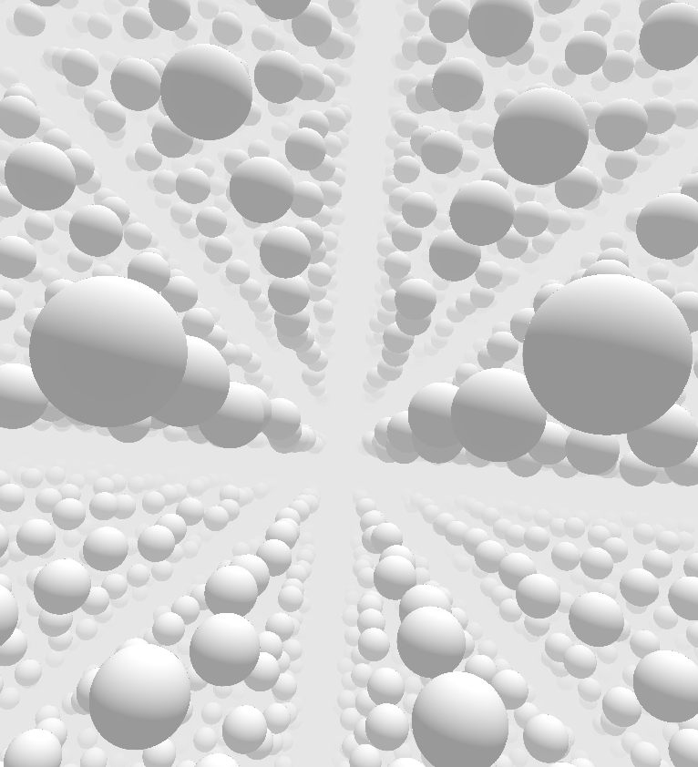

# Welcome!

In this workshop, we are looking into **shader pipelines**, and **rendering a 3D scene** in a fragment shader.

## Workshop Topics

* Shader Pipeline & GLSL
* Vertex and Fragment shader in three.js
* Implicit Geometry
* Rendering Algorithms
* Sphere Tracing
* 3D Scene Setup
* Transformations
* Constructive Solid Geometry
* Further Effects
* Examples
* Unreal shader
* Creative Exploration

This workshop will not cover shading and lighting in detail. For that there is the upcoming *Materials & Shading* workshop.

## Learning Objectives

With this workshop you gain

* a theoretical understanding of shader pipelines
* a theoretical understanding of rendering a 3D scene in a real-time context, 
* practical experiences with GLSL and shader programming.